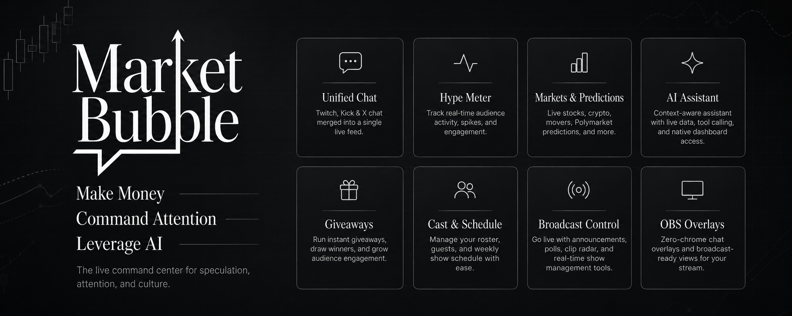

<center><a href="https://marketbubble.virta.lol"></a></center>

# MarketBubble

**Live at [marketbubble.virta.lol](https://marketbubble.virta.lol)**. If the show is offline, hit **Try Demo** and watch the dashboard run on busy live channels.

**One dashboard for a show that lives on three platforms.** Twitch, Kick and X chat merged into a single live feed, beside the stream, live market data and Polymarket predictions, in a workspace you can rearrange like an IDE.

Built for [MarketBubble](https://x.com/marketbubble), the live show about speculation, attention and culture hosted by Banks and Blknoiz06, Thursdays 1PM PT.

## Contents

- 💡 [Why it's different](#why-its-different)
- 🎛️ [Feature tour](#feature-tour)
- ⚡ [Performance & durability](#performance--durability)
- 🌐 [Platform support](#platform-support)
- 🚀 [Quick start](#quick-start)
- 📦 [Deploy](#deploy)
  - 🐳 [Docker](#docker-own-your-stack)
  - 🎨 [Render](#render-one-click-blueprint)
  - 🚂 [Railway](#railway-one-click)
  - ▲ [Vercel](#vercel-app-only-with-caveats)
- ⚙️ [Configuration](#configuration)
  - 📺 [Channel roster](#channel-roster)
  - 🔑 [Environment variables](#environment-variables)
  - 💾 [Database](#database-optional)
  - 🤖 [AI assistant key handling](#ai-assistant-key-handling)
- 🧩 [Chrome extension](#chrome-extension)
- 🔌 [Virta plugin](#virta-plugin)
- 📡 [Relay](#relay)
- 🏗️ [Stack](#stack)

## Why it's different

- **Calm by design.** Three panels by default: stream, chat, gifts. Everything else stays hidden until you add it, then closes back down. One quiet graphite theme, no always-on ticker walls.
- **Right-click anything.** Open any streamer's chat, or just their Kick, or just their Twitch, as its own panel. Drag, split, tab, or pop it out to a new window. Real panels, not a fixed columns layout.
- **Keys never touch our server.** The AI assistant is bring-your-own-key, running entirely in the browser: keys live in memory and die on reload. Operators can set keys server-side instead, locked and rate-limited per visitor.
- **Always listening.** Twitch and Kick chat stay connected around the clock, even while channels are offline. The leaderboard, giveaway pools, user-card stats and analytics keep filling between shows.
- **Ships à la carte.** No database required; everything runs in-memory out of the box. Point `DATABASE_PATH` at a SQLite file and it all becomes durable, schema included. The assistant is opt-in at runtime, removable at build time.
- **Calm under fire.** Virtualized rendering, spam combo-collapse, a read helper, keyword filters and per-channel toggles keep a three-platform firehose readable.
- **Built to run all day.** Every buffer capped, every cache pruned, every socket reconnects with backoff, hidden tabs drop to one update a second. As fast at hour six as at minute one.
- **A control room for hosts.** Push announcements, run live polls, draw giveaways, manage the cast and schedule, watch analytics, arm an auto-clipper, share branded highlight cards to X. All without touching code.

## Feature tour

**Unified chat**
- Twitch IRC + Kick Pusher + X live chat in one time-ordered feed, with emotes (native + 7TV), badges, name colors, replies, and event rows for subs, raids and gifts
- Per-streamer and per-platform chat panels, opened from a right-click context menu
- Channel filter dropdown (choose which live channels appear in the merged feed), broadcaster emphasis (the streamer's messages get a tint)
- **User cards**: click any username to see session message count and share of chat, all-time tally with overall rank (from the durable leaderboard), recent message history, and one-click author focus
- **Chat never sleeps**: Twitch and Kick chats stay connected even while channels are offline, so the leaderboard, giveaway pools and analytics keep filling between shows
- Highlight/mute keyword filters, search with click-to-jump (click a result and the live feed scrolls to that message and flashes it)
- Mention Inbox panel: every message across all channels that names you, collected even while the panel is closed
- Activity dots on background tabs when new messages arrive
- **Chat Roster** with live message counts, per-platform filter pills, username search, and a sort toggle (message count or most recent)

**Workspace**
- Dockable panels (drag, split, tab, resize, pop out to a separate window), layout persisted
- `Ctrl+K` command palette: switch channels, toggle settings, open panels, enter Stage, everything searchable
- Tabbed Settings panel: chat density, timestamps, filters, mention names, assistant, layout reset
- **Stage**: a broadcast overlay over the running dashboard (stream + chat + tickers, OBS-ready presentation mode), with one-click full screen that hides the idle cursor
- **`/overlay`**: a zero-chrome chat feed for OBS browser sources (`?channel=<id>&scale=1.4&bg=transparent&ts=0`)

**AI assistant (opt-in)**
- Native tool calling against live dashboard data: search this session's chat, top chatters, who's live, market quotes, Polymarket predictions, feed stats, show info
- Tool calls stream into the conversation as live cards, so you watch it work
- Providers: Anthropic, OpenAI, xAI, OpenRouter, with live model lists fetched per provider
- Privacy model: chat is archived in memory only (size configurable, wiped on reload); BYOK keys are in-memory and browser-direct; server-held keys are proxied, locked and rate-limited per visitor (defaults 5/min, 50/day)

**Markets**
- Live quotes for stocks and crypto, top movers, market news with article drawer
- Polymarket predictions, Hyperliquid trade feed, Fear & Greed
- Cashtags detected in chat with hover cards showing live price and change

**Streams & audience**
- Embeds the right player automatically (Twitch/Kick, picks the platform with more viewers, with a manual toggle when simulcasting)
- Per-platform viewer counts in the sidebar, combined stats in the stat band
- Offline view with next-show countdown, recent clips and trending markets
- **Hype Meter**: 30-minute sparkline of chat activity with triangle markers at spike positions, click any bucket to jump to that moment in the chat archive
- **Highlights panel**: notable chat moments with relative timestamps (just now · 3m ago · 2h 5m ago), linked to the Hype Meter markers
- **Leaderboard** of top chatters (relay-backed, roster channels only) with platform-colored subscriber badges, and on-chain traders

**News** (`/news`)
- Wall Street broadsheet layout: Walburn masthead, double rule, full-width hero + editorial sidebar, the same hierarchy a print front page uses, not a list of links
- Live RSS from CoinDesk, CoinTelegraph, Decrypt and Yahoo Finance, refreshed every 5 minutes; color-coded category chips (Crypto · Markets)
- Full-width "Latest" grid below the fold, with the leading article spanning two columns for editorial weight
- Recent Clips & Broadcasts row pulls from the streamer's Twitch clip history and YouTube channel, opening inline with the same player dialog as the main dashboard

**Admin control room** (`/admin/*`)
- Routed, password-protected pages behind one login (the key is held in memory, never stored); falls back to a real 404 when no key is configured, so it's invisible to visitors
- **Engage**: broadcast a full-screen announcement to all connected viewers; run live audience polls with option voting and inline chat-vote detection, real-time bar chart tallies, lock and clear controls
- **Roster & schedule**: the show's cast lives here. Introduce new characters or shows under the MarketBubble umbrella, retire them, edit handles, and **pin** a channel so it leads every viewer's sidebar with a golden card and pin badge. A weekly **calendar** (Pacific Time, the show's clock) lays the whole cast out as avatar chips: click a cell to schedule someone, click a chip to move or clear them. Slots drive the dashboard's next-show countdowns and live-discovery polling, and everything publishes live to every open dashboard
- **Giveaway**: draw a random viewer from every chatter the show has ever recorded, filtered by platform, minimum messages, or recent activity. A deterministic slot-machine roll plays identically on the admin screen and the OBS overlay, decelerates onto the winner (the name it lands on *is* the winner), and the result stays up until cleared
- **Controls**: push global keyword filters (highlight/mute) and feature flags to every visitor in real time; arm the **clip radar** (off by default): it watches combined chat velocity server-side, fires while a spike is still building, snapshots the surrounding chat, and (with a Twitch token) cuts a real Twitch clip whose footage starts *before* the trigger, since Twitch clips retroactively
- **Analytics**: viewer history with a hover crosshair, a GitHub-style activity heatmap (click a day to inspect it in the chart), a stream session log that can merge overlapping channels into one "unified show", per-channel totals, top chatters, and the clip-radar review strip (keep · re-trim on Twitch · dismiss)
- **Share to X**: any highlight (a day's peak viewers, a stream session with its viewer curve, a giveaway winner) renders as a letterpress-styled portrait card (the lettermark stamped on light stock, Walburn type). Copy it, download it, or post it: posting hosts the PNG and opens X with a link that unfurls into a large picture card
- **Health**: live platform connection status, relay/bridge/database state, and viewer counts across the roster
- **Rehearsal mode**: `/admin/giveaway?demo=1` and `/admin/analytics?demo=1` run on generated data, so you can demo or practice without a database or live chat
- **OBS sources** with one-click URL copy: `/overlay-poll` (the active poll, invisible when idle) and `/overlay-giveaway` (the roll + winner). Both take `?bg=transparent&scale=1.4`

**Pages**: `/` dashboard · `/markets` · `/news` · `/leaderboard` · `/about` (the show and the hosts) · `/overlay` (OBS chat) · `/overlay-poll` (OBS poll) · `/overlay-giveaway` (OBS giveaway) · `/share/<id>` (hosted highlight cards) · `/admin/*` (producer tools)

## Performance & durability

Fast chat is a rendering problem and a memory problem; both are handled deliberately:

- **One render per burst, not per message.** Incoming chat is coalesced on a ~90ms timer, so a 50-messages-per-second firehose triggers ~11 renders a second, each painting only the rows on screen (TanStack Virtual). Memoized rows mean an untouched message never re-renders.
- **Nothing grows forever.** The feed buffer (500), the read-helper queue (200), the mention inbox (500), the assistant archive (configurable), the pre-flush buffer, and the virtualizer's measurement cache are all capped or pruned. Memory at hour six looks like memory at minute one.
- **Background tabs go quiet.** Hidden tabs batch chat once a second instead of 11 times, so a pinned dashboard doesn't cook a laptop. Everything catches up instantly on focus.
- **Connections heal themselves.** Twitch IRC and Kick Pusher reconnect with exponential backoff and answer keepalives; an overnight network blip recovers without a reload.
- **Launch doesn't wait for streams.** The splash clears as soon as the app is interactive (never blocking on player iframes), optional panels are code-split and load on first open, and recent chat is restored from localStorage so a reload doesn't start from a blank feed.

## Platform support

| Platform | Chat | Stream embed | Live status | Viewer count |
|---|---|---|---|---|
| Twitch | Anonymous IRC WebSocket | Twitch player iframe | GQL + Helix API | GQL + Helix API |
| Kick | Anonymous Pusher WebSocket | Kick player iframe | Page scraping | Page scraping |
| X (live broadcasts) | Server broadcast bridge + optional Chrome extension | Link to x.com | Guest GraphQL + broadcasts/show | broadcasts/show + chat occupancy |

X has no official third-party chat API. The server watches each streamer's `xBroadcasts` list (handles or broadcast links), discovers live broadcasts via guest GraphQL, and reads chat over the same WebSocket the X web player uses. An optional Chrome extension complements the bridge by forwarding chat from your browser (including Spaces); both paths de-duplicate by message id. See [Chrome extension](#chrome-extension).

## Quick start

```bash
npm install
npm run dev          # http://localhost:3000
```

No credentials needed to try it: chat connects anonymously from the browser, and Demo mode (top right) fills the dashboard with busy live channels.

## Deploy

Four paths, same image either way. Pick by how much infra you want to own — Render and Railway run the full stack (app + relay + disk), Vercel is app-only with caveats, Docker is everything on a host you control.

### Docker (own your stack)

The fullest control — works on any host that runs containers (VPS, Coolify, Hetzner, your laptop). Brings up both the app and the relay with a persistent volume for the SQLite database.

```bash
cp .env.example .env   # fill in what you need
docker compose up -d
```

Pre-built images are published to GHCR (`ghcr.io/elythi0n/marketbubble:latest` and `…-relay:latest`); compose pulls them by default so the host doesn't need to build. Put Caddy or nginx in front for HTTPS. See the comments at the top of `docker-compose.yml` for the GHCR push flow.

### Render (one-click Blueprint)

[](https://render.com/deploy?repo=https://github.com/elythi0n/marketbubble)

[`render.yaml`](./render.yaml) defines both services and the persistent disks. In Render, **New → Blueprint**, point at this repo. Render creates the app (public) and relay (private), wires `RELAY_URL` over the internal network, and mounts a 1 GB disk at `/data` on each for SQLite + chatter tallies.

After the first deploy, fill in the secrets marked `sync: false` (Twitch creds, `X_CHAT_API_KEY`, `ADMIN_API_KEY`, any AI provider keys) in the Render dashboard. `NEXT_PUBLIC_SITE_URL` is baked into the bundle at build time — set it to your `*.onrender.com` URL (or custom domain) before the first build.

### Railway (one-click)

[](https://railway.app/new/template?template=https://github.com/elythi0n/marketbubble)

[`railway.json`](./railway.json) configures the app's Docker build and health check. In Railway, **Deploy from GitHub** and point at this repo to create the app service. To add the relay (recommended, otherwise the leaderboard falls back to session-only counts):

1. In the same Railway project, **+ New → GitHub Repo** → same repo, set the Dockerfile to `relay/Dockerfile` and the start command to `node /srv/relay/server.mjs`.
2. On the app service, set `RELAY_URL` to the relay's internal URL (Railway's private networking: `http://<relay-service>.railway.internal:8787`).
3. Attach a volume to each service at `/data`. Set `DATABASE_PATH=/data/marketbubble.db` on the app and `CHATTERS_FILE=/data/chatters.json` on the relay.

Set `NEXT_PUBLIC_SITE_URL` to the app's Railway domain before the first build (it's baked in).

### Vercel (app only, with caveats)

[](https://vercel.com/new/clone?repository-url=https://github.com/elythi0n/marketbubble)

The Next app deploys cleanly on Vercel, but two pieces have to live elsewhere:

- **Relay (optional, even on Vercel)**: with `RELAY_URL` unset, the app runs an in-process Twitch + Kick chat listener that tallies the leaderboard itself. On Vercel this works on a single warm instance — counts scatter across instances if it scales out (a hosted relay on Railway/Render fixes that), and chat-vote tallying for live polls still needs the relay. For most deploys: skip it.
- **Database**: Vercel's filesystem is ephemeral, so `DATABASE_PATH` (SQLite) won't persist. Leave it unset to run in-memory (the app degrades gracefully — see the database note below), or swap the driver in `src/lib/server/db.ts` for a hosted store (Turso, Neon, etc.).
- **SSE**: add `export const maxDuration = 300` to `src/app/api/control/stream/route.ts` and enable Fluid Compute on the project; otherwise Hobby caps streaming responses at ~10s.
- **X timeline**: the Docker image shells out to `curl` (Node's fetch gets 429'd by X). On Vercel this falls back to fetch — expect intermittent rate-limits on the X feed.

## Configuration

### Channel roster

Create `streamers.json` at the project root, or set `STREAMERS_JSON` to a JSON array:

```json
[
  {
    "id": "yourhandle",
    "name": "Your Name",
    "handles": { "twitch": "yourhandle", "kick": "yourhandle", "x": "YourHandle" },
    "platforms": ["twitch", "kick", "x"],
    "xBroadcasts": ["YourHandle", "MarketBubble"],
    "schedule": { "label": "THURSDAYS 1PM PT", "weekday": 4, "hour": 13 }
  }
]
```

`handles.x` is the creator's profile handle (avatar, links). `xBroadcasts` is what the server watches for live X chat; list a shared show account alongside the creator's own, duplicates are de-duplicated.

### Environment variables

| Variable | Required | Purpose |
|---|---|---|
| `TWITCH_CLIENT_ID` / `TWITCH_CLIENT_SECRET` | Recommended | Helix API for viewer counts and badges (anonymous GQL fallback without) |
| `TWITCH_CLIP_TOKEN` | Optional | Twitch user token with `clips:edit` so the clip radar cuts real clips (moments-only without) |
| `X_CHAT_API_KEY` | For the extension | Authenticates the Chrome extension |
| `X_BROADCAST_SOURCES` | Optional | Extra `@handles` or broadcast links for the X bridge |
| `X_MENTION_QUERIES` | Optional | Search terms for the X Mentions pane |
| `STREAMERS_JSON` | Optional | Channel roster as an env var instead of `streamers.json` |
| `RELAY_URL` | Optional | Relay for the persistent top-chatters leaderboard + live chat-vote tallying. Unset → app runs an in-process Twitch+Kick listener for the leaderboard |
| `DATABASE_PATH` | Optional | SQLite file for persistence (e.g. `/data/marketbubble.db`); unset = in-memory |
| `ADMIN_API_KEY` | Optional | Password for `/admin` (falls back to `X_CHAT_API_KEY`; route is a 404 until one is set) |
| `ADMIN_DISABLED=1` | Optional | Force the admin route to 404 regardless of key configuration |
| `ANTHROPIC_API_KEY` / `OPENAI_API_KEY` / `XAI_API_KEY` / `OPENROUTER_API_KEY` | Optional | Server-held assistant keys: locked in the UI, proxied so they never reach the browser |
| `ASSISTANT_RPM` / `ASSISTANT_RPD` | Optional | Per-visitor limits for server-held keys (default 5/min, 50/day; BYOK is unlimited) |
| `NEXT_PUBLIC_AI_DISABLED=1` | Optional | Ship the dashboard without the AI assistant entirely |
| `NEXT_PUBLIC_DEMO_DISABLED=1` | Optional | Ship live-only (hides the Live/Demo switch) |

### Database (optional)

The dashboard runs with or without a database, same features either way; the database only adds durability and history.

- **Without** (default): everything is in-memory. Announcements, flags, polls, roster and schedule overrides, chat filters, chatter tallies, clip-radar moments, giveaway state and hosted share links reset when the process restarts. Zero setup, nothing to back up.
- **With** (`DATABASE_PATH=/data/marketbubble.db`): the admin control plane hydrates from SQLite at boot and writes through on every change. An open poll survives a deploy mid-vote (per-voter dedup included), and finished polls accumulate as history. The leaderboard becomes all-time (chatter counts accumulate across app and relay restarts), which is also what the giveaway draws from and what user cards rank against. A sampler records viewer counts and chat load every minute while live, powering the admin Analytics page (navigable 1h to 30d charts, the activity heatmap, the session log; 90-day retention). Clip-radar moments and shared highlight images persist too, so review queues and `/share/<id>` links survive restarts. Uses Node's built-in SQLite driver: no extra container, no native module, no migration step (the schema migrates itself at boot).

The compose file already mounts a persistent volume at `/data`, so enabling persistence is just uncommenting `DATABASE_PATH` in `.env`. Backups are a file copy of `marketbubble.db` (plus its `-wal` sidecar), or snapshot the volume. If the file can't be opened the app logs the error and falls back to in-memory rather than failing the show.

### AI assistant key handling

Two modes, combinable per provider:

1. **Bring your own key** (default): pasted in the panel, held in plain JS memory, cleared on reload, sent only to the provider, directly from the browser. No limits; usage is between the user and their provider.
2. **Server-held** (set the env var): the provider shows as "Active · server" and is locked in the UI. The browser still builds prompts and runs tools locally; only the streaming inference call passes through `/api/assistant/proxy`, which attaches the key and enforces per-IP rate and daily limits.

Either way there is no database: the assistant's chat archive is in-memory, session-only and opt-in.

## Chrome extension

Optional, for X chat capture from your browser (including Spaces). It runs as a content script on X broadcast pages, batches messages to `/api/x/chat`, and only activates for handles whitelisted in `public/x.json`.

Options: API URL (your deployment), API key (`X_CHAT_API_KEY`), flush interval. Install via `chrome://extensions` → developer mode → load `extension/` unpacked.

## Virta plugin

Optional, for mods who run [Virta](https://github.com/elythi0n/virta) against the show's channels: a GUI plugin that docks a MarketBubble control room (show status, top chatters, predictions, X chat) next to Virta's moderation tools. The plugin brings all of its own UI; Virta only provides the sandbox and API bridge. See [virta-plugin/README.md](virta-plugin/README.md), install from URL: `https://marketbubble.virta.lol/marketbubble-virta-plugin.zip`.

## Relay

Optional. Chat connects directly from each visitor's browser; the relay's job is the persistent top-chatters leaderboard (and a shared SSE chat feed) — plus it powers live chat-vote tallying for the admin polls. It follows **only the configured roster channels** (`CHANNELS`, default `fazebanks`), joins them all at once, ignores chat bots, and persists tallies to `CHATTERS_FILE`.

```bash
node relay/server.mjs   # :8787; set RELAY_URL=http://localhost:8787 on the app
```

**Don't want to run a separate service?** Leave `RELAY_URL` unset and the app starts an **in-process Twitch + Kick chat listener** that does the leaderboard tally itself (Twitch IRC + Kick Pusher, one socket per platform, every roster channel joined on it). Flushed to the database every 30 seconds as deltas (so the all-time count accumulates across restarts), or kept in memory when no database is configured. The relay path and the in-process path are mutually exclusive — `RELAY_URL` set → relay wins; unset → in-process. The relay is still recommended if you need live chat-vote tallying for admin polls, since that codepath calls the relay directly.

## Stack

Next.js 15 · React 19 · TypeScript · Tailwind v4 · Dockview · TanStack Virtual · Framer Motion. No database, no message broker; platform connections are plain WebSockets from the browser, server routes are thin proxies for things browsers can't reach (Kick's Cloudflare, X GraphQL, provider keys).
